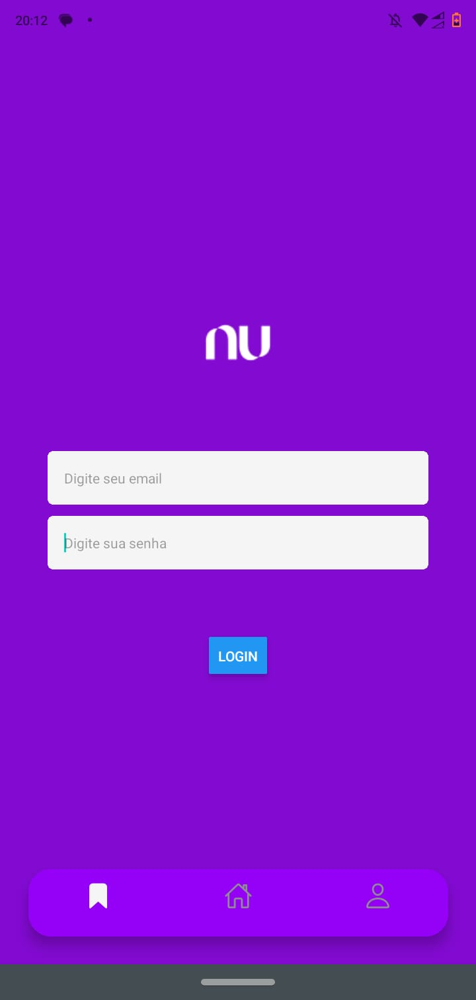
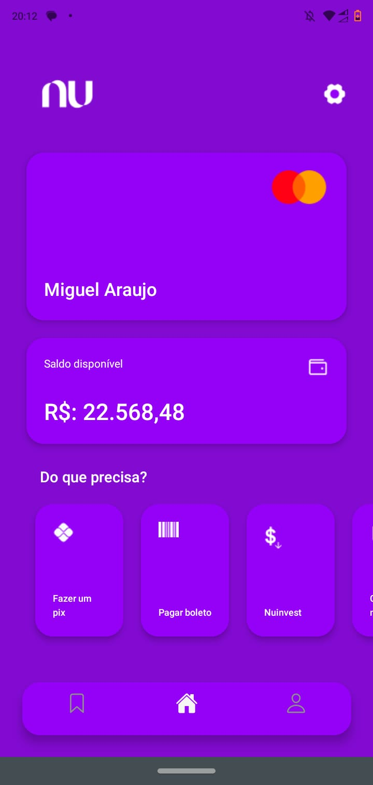
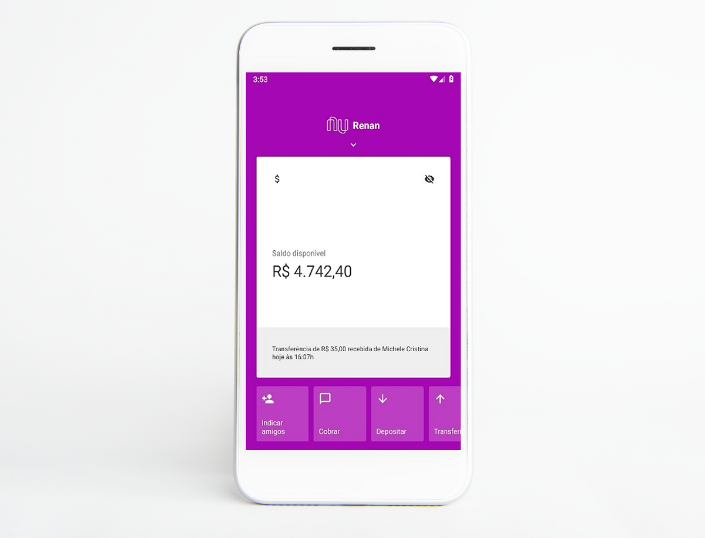

# React-native-appclone-nubank
<h1>Projeto React Native - Appclone - Nubank</h1>
Este é um projeto React Native simples que consiste em um aplicativo com três telas principais: tela de login, tela inicial (home) e tela sobre (about). O aplicativo foi desenvolvido para fins de aprendizado e demonstração.

<h1>Telas</h1>
<h2>Tela de Login</h2>
A tela de login permite que os usuários acessem o aplicativo fornecendo suas credenciais, no caso deste projeto há uma validação por meio do caractere especial '@' na caixa de email, assim dando acesso ao aplicativo.

<h2>Tela Inicial (Home)</h2>
A tela inicial exibe o conteúdo principal do aplicativo após o login bem-sucedido, a HomeScreen tem como objetivo emular a tela inicial das primeiras versões do app Nubank.

<h2>Tela Sobre (About)</h2>
A tela sobre fornece informações sobre o aplicativo, como versão, autor, e uma breve descrição e intuito do projeto. Além disso, links que direcionam para o Github e Linkedin do autor do projeto.  

<h2>Tela real da home de uma das primeiras versões do appNubank</h2>
Projeto feito em inspiração e padrão das estruturas do appnubank original.

<h2>Tecnologias Utilizadas:</h2> 

<ul><li>React Native</li>
<li>React Navigation</li>
<li>Expo go</li>  
</ul>
<h2>Contribuição</h2>
Contribuições são bem-vindas! Sinta-se à vontade para abrir uma issue para relatar problemas ou propor melhorias. Pull requests também são apreciados.
